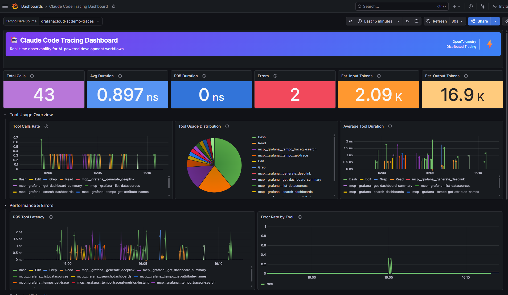

# Claude Code Tracing Workshop

Instrument Claude Code with OpenTelemetry distributed tracing. Every tool call (Read, Write, Edit, Bash, etc.) becomes a trace span in Grafana Cloud.



## What You'll Learn

- How to observe AI tooling with distributed tracing
- OpenTelemetry instrumentation in practice
- Grafana Cloud visualization of AI workflows
- How Claude Code can build its own observability dashboards via MCP

## Prerequisites

| Tool | Notes |
|------|-------|
| **Claude Code** | https://docs.anthropic.com/en/docs/claude-code |
| **Python 3.8+** | https://www.python.org/downloads/ |
| **Git** | https://git-scm.com/downloads |
| **Grafana Cloud** | Free tier at https://grafana.com |

## Setup

**[Follow the setup guide](WORKSHOP_SETUP.md)** (~5 minutes)

## How It Works

```
┌─────────────────┐    ┌─────────────────┐    ┌─────────────────┐
│   Claude Code   │───>│  OpenTelemetry  │───>│  Grafana Cloud  │
│   (Anthropic)   │    │  (trace_hook)   │    │     (Tempo)     │
└─────────────────┘    └─────────────────┘    └─────────────────┘
        │                       │                       │
        v                       v                       v
   Tool Execution          Span Creation           Visualization
   - Read files            - Context capture        - Real-time dash
   - Edit code             - Duration metrics       - Performance
   - Run commands          - Error tracking         - Workflow patterns
   - Agent calls           - Session correlation    - Historical trends
```

Claude Code hooks (`trace_hook.py`) fire on every tool call. Each call becomes an OpenTelemetry span with tool name, parameters, duration, and status. Spans export directly to your Grafana Cloud OTLP gateway.

The Grafana MCP server lets Claude query your datasources and build dashboards live — so students watch AI create its own observability stack.

## What Gets Traced

- **Tool calls**: Read, Write, Edit, Bash, Glob, Grep, Agent
- **Attributes**: file paths, command descriptions, input/output sizes, background flags
- **Performance**: duration per tool, P95 latencies, error rates
- **Privacy**: paths sanitized, credentials redacted, zero data retained locally

## Repository Structure

```
.claude/settings.json          # Hook configuration (activates tracing)
.mcp.json                      # Grafana MCP server config (edit 2 values)
trace_hook.py                  # OpenTelemetry instrumentation
dashboards/claude-code-traces.json  # Grafana dashboard
check-tracing-setup.sh         # Setup validator
.env.example                   # Credential template
WORKSHOP_SETUP.md              # Step-by-step setup guide
```

## Exploring Further

Once tracing is running, try asking Claude:

- "Add a panel showing file access patterns"
- "What are the slowest operations in my traces?"
- "Create an alert for tool calls over 10 seconds"

Claude can analyze the traces AND build the dashboards to visualize them.
