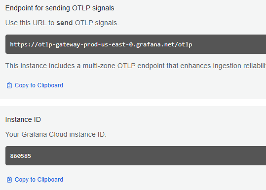
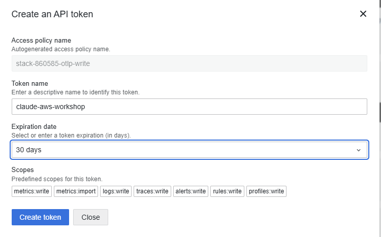
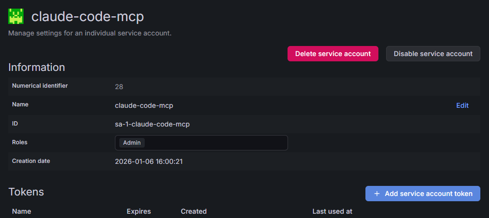

# Workshop Setup

Get Claude Code tracing working in about 5 minutes.

You'll create **two tokens** during setup. Here's why:

| Token | Prefix | What it does | Where it goes |
|-------|--------|--------------|---------------|
| **Cloud API token** | `glc_` | Sends traces to Grafana Cloud | `.env` file |
| **Service account token** | `glsa_` | Lets Claude build dashboards | `.mcp.json` file |

These are separate auth systems — one talks to the OTLP gateway, the other talks to the Grafana API.

---

## Step 1: Install Python

1. Go to https://www.python.org/downloads/
2. Download and run the installer
3. **Check "Add Python to PATH"** at the bottom of the installer
4. Click "Install Now"
5. Open a new terminal and verify: `python --version`

---

## Step 2: Create a Grafana Cloud Account

1. Sign up for free at https://grafana.com
2. Once your stack is created, note your stack URL: `https://YOUR-STACK.grafana.net`

---

## Step 3: Create Token 1 — Cloud API Token (`glc_`)

This token lets the tracing hook send trace data to Grafana Cloud.

1. Go to https://grafana.com and click **My Account**
2. Find your stack and click **Configure** under the **OpenTelemetry** section
3. Copy the **OTLP endpoint URL** and **Instance ID**:



4. Click **Generate now** to create an API token. Name it `claude-aws-workshop` and set expiration to **30 days**:



5. Copy the **token** (starts with `glc_`)

---

## Step 4: Configure .env

1. Copy `.env.example` to `.env`
2. Fill in the three values from Step 3:

```
GRAFANA_CLOUD_TOKEN=glc_your_token
GRAFANA_OTLP_GATEWAY_URL=https://otlp-gateway-prod-us-east-0.grafana.net/otlp
GRAFANA_OTLP_INSTANCE_ID=your_instance_id
TRACE_MODE=direct
```

---

## Step 5: Install Packages

```
pip install opentelemetry-distro opentelemetry-exporter-otlp mcp-grafana
```

---

## Step 6: Create Token 2 — Service Account Token (`glsa_`)

This token lets Claude query datasources and build dashboards via the Grafana API.

1. Go to `https://YOUR-STACK.grafana.net/admin/serviceaccounts`
2. Click **Add service account**
3. Name: `claude-code-mcp`, Role: **Admin**
4. Click **Add service account**, then click **Add service account token**:



5. Copy the token (starts with `glsa_`)

---

## Step 7: Configure the Grafana MCP Server

Open `.mcp.json` in the repo root and replace the two placeholder values with your stack URL and `glsa_` token:

```json
{
  "mcpServers": {
    "grafana": {
      "type": "stdio",
      "command": "mcp-grafana",
      "args": ["--transport", "stdio"],
      "env": {
        "GRAFANA_URL": "https://YOUR-STACK.grafana.net",
        "GRAFANA_API_KEY": "glsa_YOUR_TOKEN_HERE"
      }
    }
  }
}
```

Just change `YOUR-STACK` and `glsa_YOUR_TOKEN_HERE`. Leave everything else as-is.

---

## Step 8: Start Claude and Build Your Dashboard

```
claude
```

Then ask:

> "Create me a Claude Code tracing dashboard with tool usage patterns, performance metrics, and trace exploration."

Claude will query your datasources and build the dashboard live.

---

## Verify Tracing Works

1. Use Claude Code normally (read files, edit code, run commands)
2. Open your dashboard at `https://YOUR-STACK.grafana.net`
3. Traces appear within ~30 seconds

You can also run the setup checker:

```
"C:\Program Files\Git\bin\bash.exe" check-tracing-setup.sh
```

---

## Troubleshooting

**"python: command not found"** — Close and reopen your terminal. Try `py --version` instead.

**"pip install failed"** — Try `py -m pip install ...` instead.

**"MCP server connection failed"** — Check your `glsa_` token in `.mcp.json` has Admin permissions. Make sure `mcp-grafana` is installed (`pip install mcp-grafana`).

**"No traces appearing"** — Check `.env` has the right `glc_` credentials. Restart Claude Code after installing packages.
